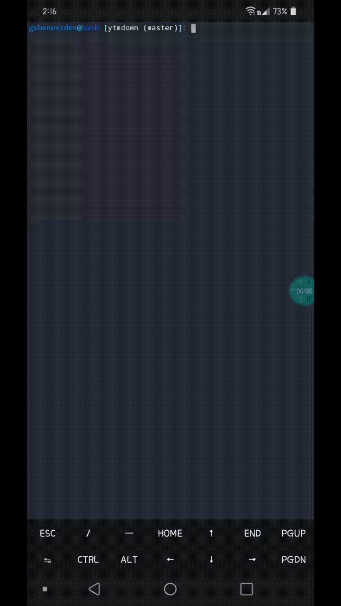

# minify-cli

Easily mimic your html, css and js files, in an easy, practical and automated way. No need to select file by file. It uses node-minify as its main engine, learn more.


## Install
Using yarn:
```
yarn global add minify-cli
```
Using npm:
```
npm instal -g minify-cli
```
## Use

 
1. To perform the initial configuration, run _minify-cli init_, where you will select the files to be mimicked, those that will be listed in the package.json.
2. To mimic use _minify-cli start_.

 
## Contributions
 
Please read [CONTRIBUTING.md](CONTRIBUTING.md) for details on our code of conduct and the process for submitting pull requests to us.
 
## License
 
This project is licensed under the MIT license - see the [LICENSE](LICENSE) file for details.
 